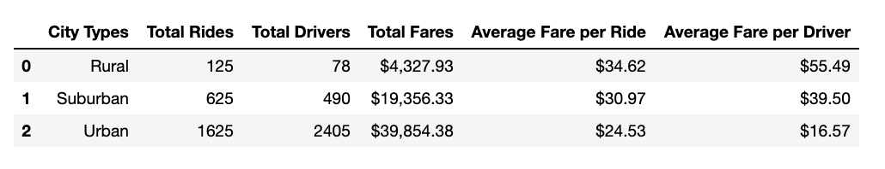
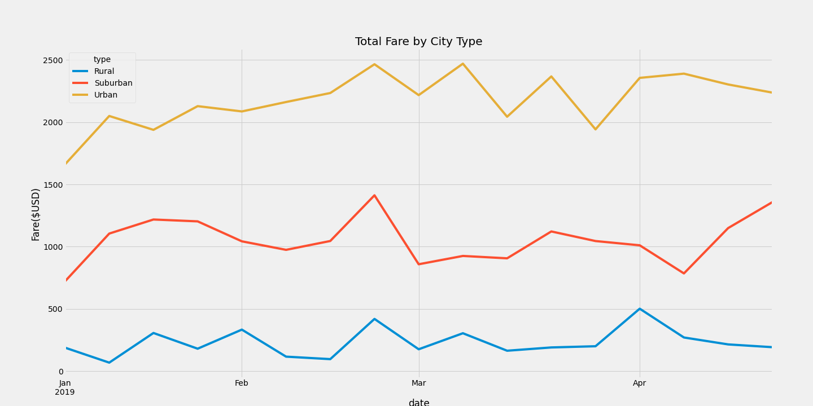

# PyBer_Analysis
## Overview of the analysis

Using Python skills and knowledge of Pandas, we are to create a summary DataFrame of the ride-sharing data by city type. 
Using Pandas and Matplotlib, we are to create a multiple-line graph that shows the total weekly fares for each city type. A written report that summarizes how the data differs by city type and how those differences can be used by decision-makers at PyBer.

## Resources
Data Source: PyBer_Challenge_starter_code.ipynb 

Software: Matplotli 3.2.2, Python 3.9, Visual Studio Code 1.50.0, Anaconda 4.8.5, Jupyter Notebook 6.0.3, Pandas

## Results
The Ride-sharing data in the Rural:

The total rides is 125 with 78 total drivers. The Total fares is $4,327.93 with an average of $34.62 per ride and $55.49 per driver.

The Ride-sharing data in the Suburban:

The total rides is 625 with 490 total drivers. The Total fares is $19,356.33 with an average of $30.97 per ride and $39.50 per driver.

The Ride-sharing data in the Urban:

The total rides is 1625 with 2405 total drivers. The Total fares is $39,854.38 with an average of $24.53 per ride and $16.57 per driver.

## Summary

Based on the results, provide three business recommendations to the CEO for addressing any disparities among the city types.
